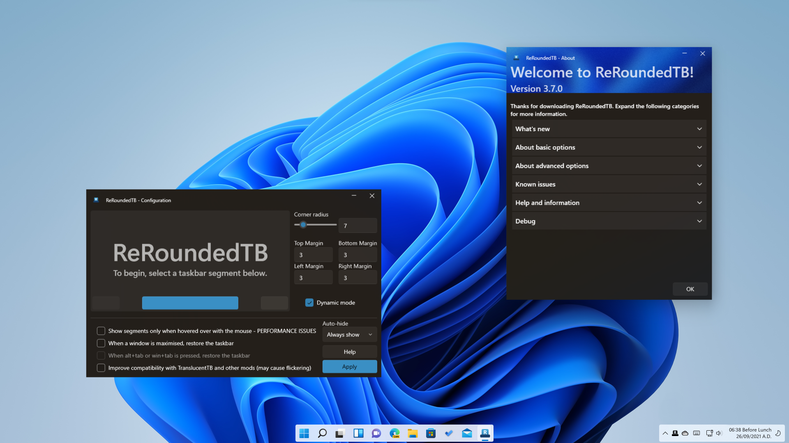

 ReRoundedTB

# ReRoundedTB
#### Add margins, rounded corners and segments to your taskbars!

ReRoundedTB is a maintained fork of [RoundedTB](https://github.com/torchgm/RoundedTB) by torchgm, which is no longer developed. It fixes bugs on current Windows 11 builds and runs on a supported .NET version.



## How do I get it?
1. Install the [.NET 10 Desktop Runtime](https://dotnet.microsoft.com/download/dotnet/10.0) (x64) if you don't have it.
2. Download the latest `ReRoundedTB_*.zip` from [Releases](https://github.com/RealCarvedArt/ReRoundedTB/releases/latest), unzip it anywhere and run `ReRoundedTB.exe`.
3. ReRoundedTB starts in the tray. Left-click its tray icon to open the settings.

**Requirements:** Windows 11, or Windows 10 for [split mode](#configuring-split-mode-on-windows-10). Windows 10 support comes from RoundedTB and hasn't been tested in ReRoundedTB.

**Switching from RoundedTB:** close RoundedTB from its tray icon first. ReRoundedTB won't start while RoundedTB is running, so the two don't fight over the taskbar. Settings from RoundedTB P3.2 or later (including the RoundedTB-named 3.7.0) carry over fully. With settings from RoundedTB R3.1 or earlier, the dynamic mode setting carries over, but margins and corner radius go back to the defaults.

**Verifying a download:** releases are built by GitHub Actions with signed build provenance. To check a download was built from this repository's `master` branch by its release workflow, run this with the [GitHub CLI](https://cli.github.com/):

```
gh attestation verify <file> --repo RealCarvedArt/ReRoundedTB --source-ref refs/heads/master --signer-workflow RealCarvedArt/ReRoundedTB/.github/workflows/ci.yml
```

## To use
The preview at the top of the settings window shows your taskbar's segments. Click a segment to edit it, change the values, then click **Apply**.

### Basic options
- **Corner radius** - how rounded the selected segment's corners are.
- **Top, bottom, left and right margin** - how many pixels to trim from each side of the selected segment. The trimmed area is see-through and click-through. You can also use negative values to hide the rounded corners on a side, which "attaches" the taskbar to that edge of the screen.

Without dynamic mode, the whole taskbar is a single segment.

### Advanced options
- **Dynamic mode (Windows 11)** - shrinks the taskbar to fit its icons, a bit like the macOS Dock. The app list and the system tray become separate segments. When the taskbar is centred, there's also a widgets segment on the far left, where Windows puts its Widgets button; it's only useful if Widgets is turned on in Windows' taskbar settings. Each segment has its own corner radius and margins.
- **Show this segment** - shown when the tray or widgets segment is selected; shows or hides that segment in dynamic mode. Press <kbd>Win</kbd>+<kbd>F2</kbd> at any time to toggle the tray.
- **Show segments only when hovered over with the mouse** - shows the tray and widgets segments only while the mouse is over them. This uses more CPU.
- **When a window is maximised, restore the taskbar** - turns the taskbar back to normal on any monitor with a maximised window.
- **When alt+tab or win+tab is pressed, restore the taskbar (Windows 11)** - does the same while the task switcher is open. Needs the option above.
- **Improve compatibility with TranslucentTB and other mods** - lets ReRoundedTB work alongside [TranslucentTB](https://github.com/TranslucentTB/TranslucentTB). Due to a bug in Windows, apps that change the taskbar's composition stop ReRoundedTB's changes from showing up; this asks TranslucentTB to refresh the taskbar after each change. It may flicker slightly. RoundedTB's author built this with [Sylveon](https://github.com/sylveon) of TranslucentTB for TranslucentTB 2021.5; newer versions haven't been tested.
- **Split mode (Windows 10)** - replaces dynamic mode on Windows 10. It separates the taskbar from the system tray so you can resize it by hand; see [Configuring split mode on Windows 10](#configuring-split-mode-on-windows-10).
- **Auto-hide** - "Always show" is the default. "Always hide" fades the taskbar out until the mouse reaches the bottom of the screen. This is ReRoundedTB's own auto-hide and is experimental. Keep Windows' own taskbar auto-hide turned off.

### Tray menu
- **Run at startup** - starts ReRoundedTB when you sign in.
- **Pause (show the normal taskbar)** - puts your taskbars back to normal without quitting. Shaping resumes when you untick it, click **Apply**, press <kbd>Win</kbd>+<kbd>F2</kbd> or restart ReRoundedTB; the pause isn't remembered.
- **Reset settings to defaults...** - after asking, sets the corner radius, margins and options back to how they were on first install and reshapes the taskbar. It can't be undone, and doesn't change **Run at startup**.
- **Show / Hide ReRoundedTB** - opens or hides the settings window. Closing the settings window also hides it to the tray.
- **Close ReRoundedTB** - quits and puts your taskbars back to normal.

The **Help** button opens the About window, where the **Debug** section can open your settings file.

## Known issues
- Windows' own taskbar auto-hide setting isn't supported and can cause heavy flickering or an unreachable taskbar. ReRoundedTB's own auto-hide is experimental and may flicker, especially with TranslucentTB compatibility or dynamic mode on. ([#36](https://github.com/torchgm/RoundedTB/issues/36))
- Rounded corners aren't antialiased, due to a Windows limitation. ([#4](https://github.com/torchgm/RoundedTB/issues/4))
- Dynamic mode and split mode only work when the taskbar is at the top or bottom of the screen.
- Split mode on Windows 10 only supports the main taskbar; secondary taskbars aren't split.
- In dynamic mode the taskbar can occasionally end up the wrong size or not update. Opening or moving a window on that monitor, or briefly changing the taskbar alignment, usually corrects it.
- Taskbar mods other than TranslucentTB may conflict with ReRoundedTB.

Fixed in ReRoundedTB: dynamic mode not hiding the left side of the taskbar when the alignment has never been changed ([#98](https://github.com/torchgm/RoundedTB/issues/98)), dynamic mode cutting off icons on current Windows 11, second-monitor taskbars disappearing in dynamic mode, the taskbar going square after running for a while, and taskbars staying square after Explorer restarts.

## Troubleshooting
- **Nothing happens to the taskbar and there's no tray icon:** your antivirus may have sandboxed ReRoundedTB. Builds aren't code-signed yet, so tools such as Comodo can auto-contain them, especially on first launch. First [verify the download](#how-do-i-get-it), then allow that specific file in your antivirus. Where your antivirus offers it, trust the file by its hash or signature rather than excluding its folder, so a changed file gets scanned again. Repeat this after each update.
- **Something breaks badly:** press <kbd>Ctrl</kbd>+<kbd>Shift</kbd>+<kbd>Esc</kbd> to open Task Manager, end ReRoundedTB, then restart Windows Explorer. At worst, reboot. ReRoundedTB makes no permanent changes to Windows, so this clears any issues.
- **Uninstalling:** turn off **Run at startup** in the tray menu, close ReRoundedTB, then delete its folder. Your settings are in `%LOCALAPPDATA%\rtb.json` if you want to remove them too (older versions also left an empty `rtb.log` there).

## Configuring split mode on Windows 10
Split mode is a simplified version of dynamic mode for Windows 10, whose taskbar can't be resized automatically. It separates the taskbar from the system tray and lets you resize it by hand, after some setup.

**Limitations**
- Split mode doesn't resize itself automatically.
- Toolbars aren't compatible with split mode and need to be turned off, apart from one. That one toolbar marks the "empty" space on the taskbar.
- Split mode only works when the taskbar is horizontal at the top or bottom of the screen, and on the primary monitor.

**Setup**
1. Right-click the taskbar and turn off "Lock the taskbar".
2. Right-click it again and turn off any existing toolbars.
3. Right-click a third time and select Toolbars > Desktop.
4. Use the small <kbd>||</kbd> handle to resize the taskbar as you please.

This video from the original RoundedTB shows the setup:

https://user-images.githubusercontent.com/31840547/134795022-1312d011-40f2-4641-8c8d-3d6c0e752747.mp4

## Code signing policy
Free code signing provided by [SignPath.io](https://about.signpath.io), certificate by [SignPath Foundation](https://signpath.org).

> **Status:** code signing is being set up. Until it's active, releases are unsigned. You can still confirm a download was built from this repository with `gh attestation verify` (see [How do I get it?](#how-do-i-get-it)).

Releases are built automatically from this repository by GitHub Actions, and every signing request is approved manually.

**Team roles**
- Committers and reviewers: [RealCarvedArt](https://github.com/RealCarvedArt)
- Approvers: [RealCarvedArt](https://github.com/RealCarvedArt)

**Privacy policy**
This program will not transfer any information to other networked systems unless specifically requested by the user or the person installing or operating it.

What stays on your PC:
- `%LOCALAPPDATA%\rtb.json` holds your settings (margins, corner radius and options; nothing personal). A `rtb.json.tmp` may be left beside it if the PC loses power mid-save.
- With **Run at startup** on, a `ReRoundedTB.lnk` shortcut in your Startup folder.
- To find taskbars, maximised windows and the task switcher, ReRoundedTB looks at other windows' class names, positions and states while it runs. It doesn't read their titles or contents, and stores none of it.
- It has no telemetry, update check or network code. The only links it opens are the GitHub pages in its Help window, and only when you click them.
- If ReRoundedTB crashes, Windows may log it and, if you've turned on Windows error reporting, send a report to Microsoft (it can include file paths and a snapshot of memory). You control this in Windows' privacy settings; ReRoundedTB itself sends nothing.

## Credits and licence
ReRoundedTB is based on [RoundedTB](https://github.com/torchgm/RoundedTB), created by torchgm. Parts of this README are adapted from RoundedTB's documentation. Like RoundedTB, ReRoundedTB is free software under the [GNU General Public License v3.0](LICENSE).
