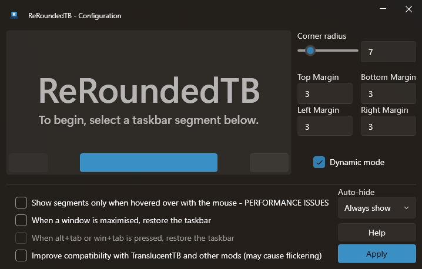
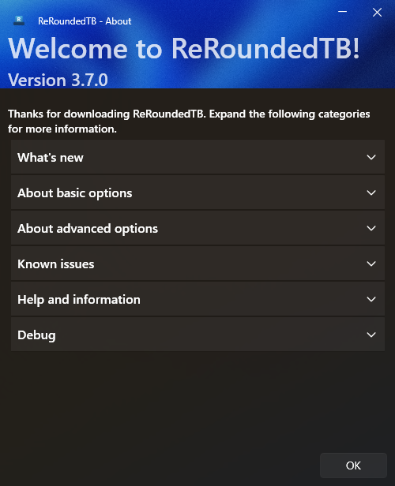

 ReRoundedTB

# ReRoundedTB
#### Add margins, rounded corners and segments to your taskbars!

ReRoundedTB is a maintained fork of [RoundedTB](https://github.com/torchgm/RoundedTB) by torchgm, which is no longer developed. It fixes bugs on current Windows 11 builds and runs on a supported .NET version. The original author's documentation below still applies.

  
  

## How do I get it?
Download the latest `ReRoundedTB_*.zip` from [Releases](https://github.com/RealCarvedArt/ReRoundedTB/releases/latest), unzip it and run `ReRoundedTB.exe`. It needs the [.NET 10 Desktop Runtime](https://dotnet.microsoft.com/download/dotnet/10.0) (x64). Settings from RoundedTB carry over automatically. If you're switching from the original RoundedTB, close it first so the two don't fight over the taskbar.

Releases are built by GitHub Actions with signed build provenance. To check a download came from this repository, run `gh attestation verify <file> --repo RealCarvedArt/ReRoundedTB` with the [GitHub CLI](https://cli.github.com/).

## To use
### Basic options
The simplest way to use RoundedTB is by simply entering a margin and corner radius.
 - **Margin** - controls how many pixels to remove from each side of the taskbar, creating a margin around it that you can see and click through.
 -  **Corner Radius** - adjusts how round the corners of the taskbar should be.

### Advanced options
The advanced options allow for further customisation, at the cost of some user-friendliness.
- **Independent Margins** - in the advanced settings, a <kbd>...</kbd> button appears on the margin box. Click it to enable independent margins, which allow you to specify the margin for each side of the taskbar. You can also use negative values to hide the rounded corners for some sides, allowing you to "attach" the taskbar to different sides of the monitor.
- **Dynamic Mode (Windows 11)** - dynamic mode automatically resizes the taskbars to accommodate the number of icons in it, making the taskbar behave similarly to macOS' Dock.
- **Split Mode (Windows 10)** - split mode is a simplified version of dynamic mode for Windows 10. Due to a more limited taskbar, dynamically resizing the taskbar isn't possible. However after some setup, split mode allows you to separate the taskbar from the system tray and resize it at will. I admit it's certainly not as cool as dynamic mode but for now it's better than nothing 🥺. For info on setting up, see the bottom of this readme.
- **Show System Tray** - this toggles whether or not the system tray, clock etc. is displayed in dynamic/split mode. It can be toggled at any time by pressing <kbd>Win</kbd>+<kbd>F2</kbd>.
- **TranslucentTB Compatibility** - due to a bug in Windows, apps that alter the composition of the taskbar don't allow RoundedTB's changes to show up automatically. Whilst I'm currently not aware of a fix, I've worked closely with [Sylveon](https://github.com/sylveon) to enable some level of compatibility between [TranslucentTB](https://github.com/TranslucentTB/TranslucentTB) and RoundedTB. This is experimental and *will* flicker slightly. It requires TranslucentTB version 2021.5 to function.
- **About RoundedTB** - provides information about the current version of RoundedTB. The "Debug" section lets you open the config and log files.

## Known issues
 - Auto-hiding is still incredibly experimental and may lead to a lot of flickering, especially with TranslucentTB compatibility or dynamic/split mode enabled. ([#36](https://github.com/torchgm/RoundedTB/issues/36))
 - Rounded corners are not antialiased due to a Windows limitation. ([#4](https://github.com/torchgm/RoundedTB/issues/4))
 - Dynamic mode/split mode only work correctly when the taskbar is horizontal at the top/bottom of the screen.
 - Split mode on Windows 10 only supports the main taskbar, secondary taskbars will not be split.
 - When using dynamic mode, the taskbar may occasionally become too large, too small or not update. This can usually be fixed by moving a window to or from that monitor or briefly changing the taskbar alignment. These issues will be reduced in upcoming updates, don't worry! I just need to refactor a lot of code first.
 - Compatibility with taskbar mods outside of TranslucentTB version 2021.5 is not currently guaranteed.

Fixed in ReRoundedTB: dynamic mode not hiding the left side of the taskbar when the alignment has never been changed ([#98](https://github.com/torchgm/RoundedTB/issues/98)), dynamic mode cutting off icons on current Windows 11, and second-monitor taskbars disappearing in dynamic mode.

## Other info
If anything breaks catastrophically, press <kbd>Ctrl</kbd>+<kbd>Shift</kbd>+<kbd>Esc</kbd> to open Task Manager, end ReRoundedTB and then restart Explorer. At worst, just reboot your PC. ReRoundedTB makes no permanent changes (though it will run on startup if you enable it from the tray icon), so restarting should clear any issues.

## Credits and licence
ReRoundedTB is based on [RoundedTB](https://github.com/torchgm/RoundedTB), created by torchgm. The documentation above was written by the original author. Like RoundedTB, ReRoundedTB is licensed under the [GNU General Public License v3.0](LICENSE).

### Configuring split mode on Windows 10
Split mode has a couple of limitations and requires a small amount of setup to get working properly.
#### Limitations
- Split mode doesn't resize itself automatically. This feature will be coming to RoundedTB for Windows 10 in the future.
- Toolbars are not compatible with split mode currently, and will need to be disabled apart from one. This is because toolbars are used to mark the "empty" space on the taskbar.
- Split mode only works when the taskbar is horizontal at the top or bottom of the screen, and on the primary monitor.
#### Setup
1. Right-click the taskbar and disable "Lock the taskbar".
2. Right-click it again and turn off any existing toolbars.
3. Right-click a third time, select Toolbars > Desktop.
4. Use the small <kbd>||</kbd> handle to resize the taskbar as you please.

Watch the following video for a guide on setting up split mode:

https://user-images.githubusercontent.com/31840547/134795022-1312d011-40f2-4641-8c8d-3d6c0e752747.mp4

